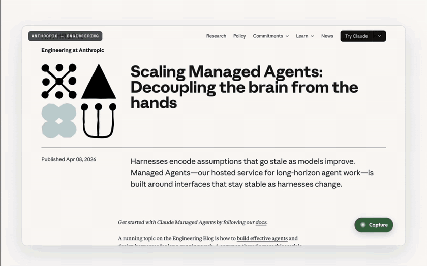
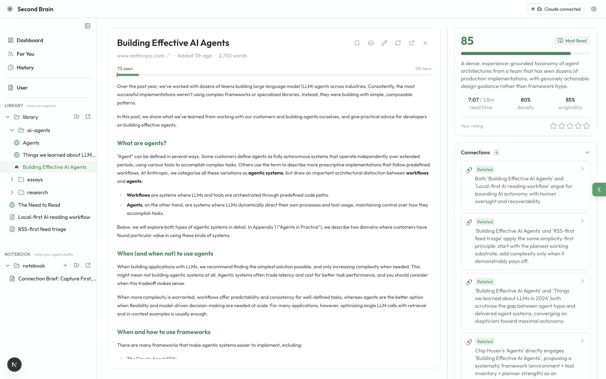
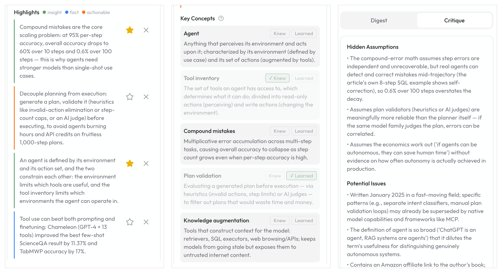
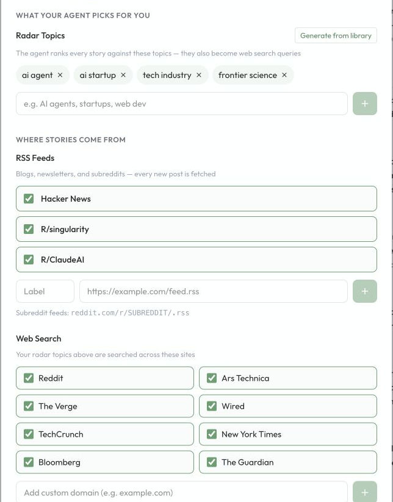
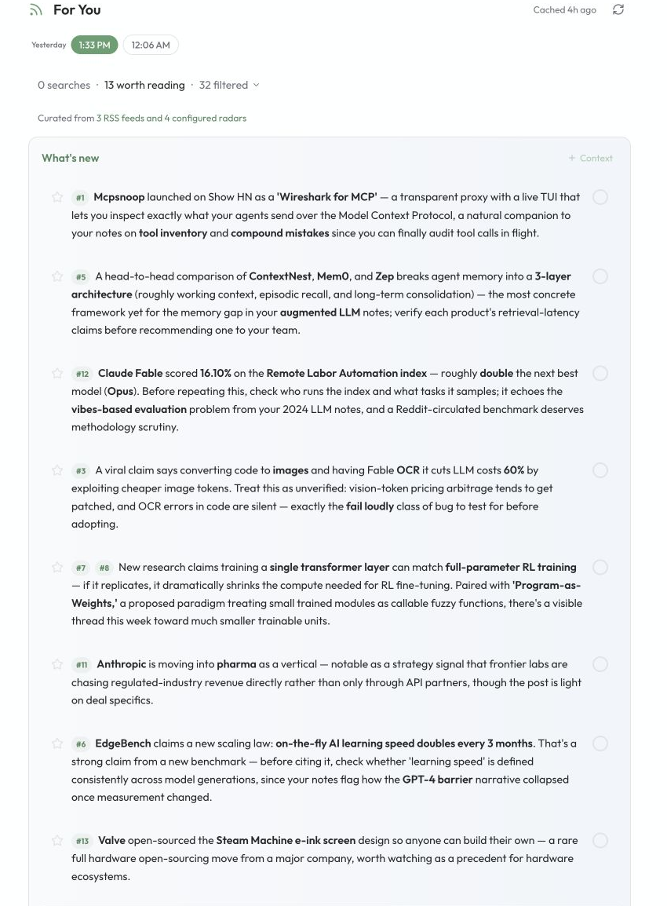

<div align="center">


# Second Brain

### You can't read everything. You don't have to.

[](LICENSE)
[](#get-started-in-2-minutes)
[](#your-data-stays-yours)
[](CONTRIBUTING.md)

**Information grows faster than any brain can follow. Second Brain is a local-first
workspace with an agent inside: it triages and critiques what you capture, finds
meaningful connections across your library, remembers what you know, and
proactively recommends sources you'd actually want.**

The reading — and the judgment — stay yours.

[Get started](#get-started-in-2-minutes) · [What you get](#what-you-get) · [Why local-first](#your-data-stays-yours) · [Chrome extension](#capture-anything-in-one-click)



**[▶ Watch the full video](https://x.com/ranli_thinker/status/2073458125391425759)**

</div>

---

## AI content got louder. Your brain didn't get bigger.

The problem isn't too much to read. It's too much that looks worth reading.

Every feed is now full of polished, plausible essays, threads, reports, recaps, and hot takes. You open too many, trust too few, forget most of them, and still end the day unsure what deserved your attention.

Second Brain is a local-first **personal knowledge base** with an agent inside. It helps you judge what matters, digest what is worth keeping, connect it to what you already know, and turn your reading back into your own work.

## What you get

### Don't outsource your understanding — or your judgment

Nobody needs one more tool that turns essays into three bullets so you can pretend you read them. Second Brain's AI does two jobs — and reading for you isn't one of them:

- **Capture anything in seconds** — paste a link or text, drop a PDF or image, or one-click the Chrome extension (logged-in and JS-rendered pages included).
- **Filter before you read** — every capture gets scored and critiqued, so you can recognize AI slop and shallow takes before they cost you twenty minutes.
- **Deepen what matters** — when something *is* worth reading, the original stays front and center with digest, concepts, hidden assumptions, and shaky claims beside it.
- **Let the library argue with itself** — new captures are checked against the most relevant sources in your library: what they support, repeat, or **contradict**.
- **Bilingual reading on demand** — one-click toggle between English and Chinese across the curated feed and reading view with instant browser translation, while strictly preserving original English source links.

Every verdict is advisory. Every analysis is editable. The reader stays human — that's the point, not a limitation.

<div align="center">

<br/>
<em>The original stays front and center. The verdict, the critique, and a "this contradicts what you read last week" sit beside it.</em>
</div>

<div align="center">

<br/>
<em>Beside every worthwhile read: the quotes worth keeping, the concepts worth learning (Knew / Learned), and a critique that keeps you honest.</em>
</div>

### Agentic to the core

- **Your library is the agent's workspace** — plain local files mean the agent reads and organizes the exact same files you see. Hand it content anytime: reorganize the library, or draft a post from what you've been reading lately, straight into your Notebook.
- **It learns from your behavior, not just your settings** — clicks, reading history, ratings, starred or dismissed highlights, Knew / Learned concepts, and For You actions become local feedback signals. The more you use it, the sharper the agent gets about what is worth your attention.
- **Information comes to you** — the "For You" feed ranks RSS (and optional search) against your interests and reading history. It breaks the bottleneck of only knowing what you went looking for. Works out of the box, no API key.
- **You control what it knows** — `USER.md` holds your explicit preferences; `MEMORY.md` is the agent's own evolving notes about you, visible and editable right in the app. Modern agent memory, without the black box.

<div align="center">

<br/>
<em>Ask across your library — the agent works the same files you see, and shows its work.</em>
</div>

### Tune the radar, and the feed follows

"For You" is not a generic news feed. Tune the radar topics, RSS feeds, and optional web search sources yourself; Second Brain ranks fresh stories against what you've already read, upvoted, and skipped. Start the morning with a briefing that speaks in terms of *your* library, not headlines.

<table>
  <tr>
    <td width="42%" align="center" valign="middle">
      <h4>1. Tune what it watches</h4>
      
      <br/><sub><b>User-tunable by design</b> — generate topics from the library, edit them by hand, or change the source mix any time.</sub>
    </td>
    <td width="58%" align="center" valign="top">
      <h4>2. Get a library-aware briefing</h4>
      
      <br/><sub><b>Start with the briefing</b> — fresh stories explained against your radar and what you've already read.</sub>
    </td>
  </tr>
</table>

## Get started in 2 minutes

All you need is **Node 20+** and one agent CLI you already use, signed in:
[Claude Code](https://docs.claude.com/en/docs/claude-code/setup) (`claude`) or [OpenAI Codex](https://github.com/openai/codex) (`codex`).
Core analysis runs through that local CLI: no separate model API key, no metered bill from Second Brain.

```bash
git clone https://github.com/ryannli/secondbrain.git
cd secondbrain
npm install
npm run dev
```

Open [http://localhost:3000](http://localhost:3000), confirm your agent shows **Connected**, and hit **Enable Agent Mode**. First launch seeds a small example library so you can feel the product before capturing anything.

Want a guided path? See [docs/ONBOARDING.md](docs/ONBOARDING.md).

<a id="chrome-extension"></a>
## Capture anything in one click

The optional **Chrome extension** captures pages exactly as you see them — including logged-in pages, JS-heavy apps, and tweets. Bookmark a tweet on X and it lands in your library automatically (you can turn that off).

Load it from `chrome://extensions` → **Load unpacked** → select the `extension/` folder. A welcome page opens, checks the connection, and walks you through the rest.

No extension? Paste links, text, PDFs, and images straight into the dashboard.

## Your data stays yours

Second Brain is built so your reading history does not become someone else's cloud dataset.

- **You choose where the data lives** — use the default local folder or point `SECONDBRAIN_ROOT` at any folder you control.
- **Your captures remain your evidence** — original pages and files are preserved; AI analysis is editable workspace you can regenerate or delete.
- **Your interaction history stays local too** — UI history, reading signals, feed actions, and agent conversations live in your data folder as part of the feedback loop.
- **There is no Second Brain cloud** — content is analyzed through your authenticated local agent session, not through a hosted Second Brain backend.

### What gets stored

Think of your user data as a folder you can open in Finder:

```text
User Data
├── Library      things you captured
│   ├── Saved article
│   └── Research paper
└── Notebook     things you or your agent wrote from those sources
    ├── Weekly brief
    └── Draft outline
```

Each Library item is a small folder of files. Each Notebook item is a small folder of files too. You can inspect them, back them up, sync them, move them, or delete them with normal file tools.

## Under the hood

<details>
<summary><b>Feed generation</b></summary>

The For You feed has two inputs:

- RSS feeds, enabled by default and editable in **Settings → Feed**.
- Optional web search, enabled only when you add a [Brave Search API key](https://brave.com/search/api/).

Radar topics from Settings tune both feed ranking and web-search queries, so the briefing stays connected to what you already care about.

To enable web search:

```bash
cp .env.example .env.local   # then paste your key into BRAVE_SEARCH_API_KEY
```

`.env.local` is git-ignored. Without a key, the feed still runs on RSS and says so clearly.

</details>

<details>
<summary><b>Agent runtime</b></summary>

Second Brain calls a local agent CLI via subprocess — Claude Code (`claude`) or OpenAI Codex (`codex`). Pick your provider in Agent Mode setup or Settings.

- Core analysis runs through your authenticated local agent session, so no separate model API key is required.
- Agent Mode is required: if no provider is connected, you get a setup gate instead of a degraded app.
- Prompt/response debug logs are **off by default**. `SECONDBRAIN_AGENT_DEBUG_LOGS=1` enables them for local debugging only — they can contain source text.

Provider-specific spawn details stay in the provider layer; the rest of the app calls one shared agent interface.

</details>

<details>
<summary><b>Development</b></summary>

```bash
npm test
npm run lint
npm run build
```

Pipeline tracing: `SECONDBRAIN_DEBUG=1 npm run dev`.

Contributor guide: [CONTRIBUTING.md](CONTRIBUTING.md). Agent-facing project context lives in [AGENTS.md](AGENTS.md) (`CLAUDE.md` is a symlink so Claude Code and Codex share one context).

</details>

## License

[MIT](LICENSE)
